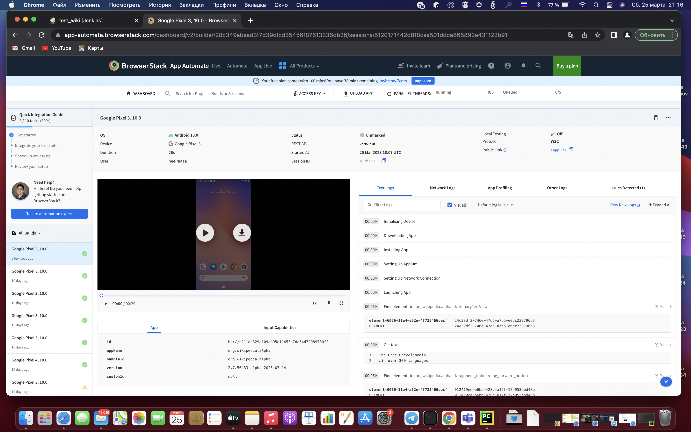
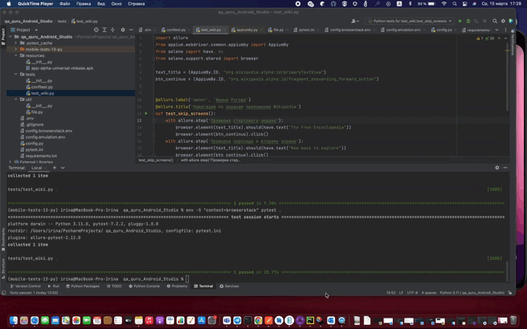

## Проект Mobile автотестов для приложения Wikipedia

<!-- Технологии -->

### Используемые технологии
<p  align="center">
  <code></code>
  <code></code>
  <code></code>
  <code></code>
  <code></code>
  <code></code>
  <code></code>
  <code></code>

</p>

### Что выполняет тест:
Навигацию по экранам приложения Wikipedia 
- [x] Проверка стартового экрана
- [x] Проверка перехода к второму экрана
- [x] Проверка перехода к третьему экрану
- [x] Проверка перехода к четвертому экрана

## :computer: Запуск тестов из терминала
```bash
env -S "context=browserstack" pytest .
env -S "context=emulation" pytest .
```

<!-- Browserstack -->

###  Запуск проекта в [Browserstack](https://app-automate.browserstack.com/dashboard/v2/builds/f28c349abaad3f7d39dfcd35456f87613336db26/sessions/5120171442d8f8caa501ddce865892e431122b91)
##### Где в реальном времени можно следить за прохождением теста через логи.



<!-- Android Studio -->
###  Запуск проекта в Android Studio
